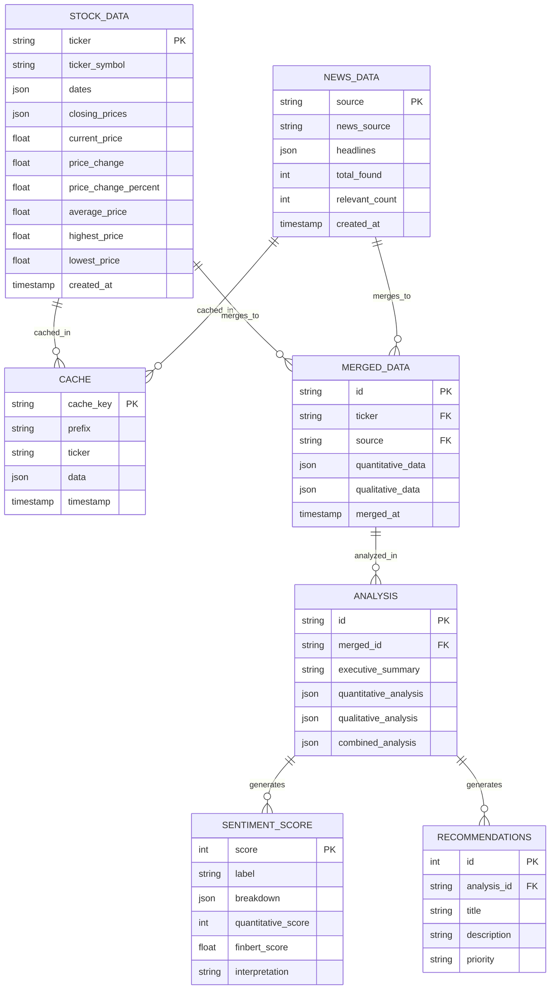

# Database Diagram - BI Engine

## Entity Relationship Diagram (ERD)



---

## Data Flow Diagram

```
┌─────────────────┐
│  Yahoo Finance   │
│  (yfinance)     │
└────────┬────────┘
         │
         ▼
┌─────────────────┐
│ StockDataCollector│
│ (Closing Prices) │
└────────┬────────┘
         │
         ▼
┌─────────────────┐
│  Cache Manager  │
│ (JSON Cache)    │
└────────┬────────┘
         │           ┌─────────────────┐
         │           │  CNBC News      │
         │           │ (Web Scrape)    │
         │           └────────┬────────┘
         │                    │
         │                    ▼
         │           ┌─────────────────┐
         │           │   NewsScraper   │
         │           └────────┬────────┘
         │                    │
         └──────────┬─────────┘
                    │
                    ▼
┌─────────────────────────────────────┐
│         DataMerger                  │
│   (Combine Quantitative + Qualitative)│
│                                     │
│   - stock_data (quantitative)        │
│   - news_data (qualitative)         │
└──────────────┬────────────────────┘
               │
               ▼
┌──────────���──────────────────────────┐
│        MarketAnalyzer               │
│    (Quantitative Analysis)         │
│    - price_change_percent         │
│    - current_price                │
│    - trend (positif/netral/negatif)│
└──────────────┬────────────────────┘
               │
               ▼
┌─────────────────────────────────────┐
│        DLAnalyzer (FinBERT)       │
│    (Qualitative Analysis)          │
│    - sentiment analysis           │
│    - positive/negative/neutral    │
│    - average_score (1-10)         │
└──────────────┬────────────────────┘
               │
               ▼
┌─────────────────────────────────────┐
│       SentimentScorer              │
│    (Final Score 1-10)             │
│    - Quantitative: 40%            │
│    - Qualitative (FinBERT): 60%    │
└──────────────┬────────────────────┘
               │
               ▼
┌─────────────────────────────────────┐
│     BusinessRecommender            │
│    (3 Recommendations)              │
│    1. Price-based                 │
│    2. Sentiment-based              │
│    3. Combined analysis           │
└─────────────────────────────────────┘
```

---

## Table Definitions

### 1. STOCK_DATA TABLE
Stores historical stock closing prices from Yahoo Finance.

| Field | Type | Description |
|-------|------|-------------|
| id | INTEGER PRIMARY KEY | Auto-increment ID |
| ticker | TEXT | Stock symbol (e.g., AAPL, MSFT) |
| dates | JSON ARRAY | Array of dates ["2024-01-01", ...] |
| closing_prices | JSON ARRAY | Array of prices [150.25, 151.00, ...] |
| current_price | REAL | Latest closing price |
| price_change | REAL | Price change amount |
| price_change_percent | REAL | Price change percentage |
| average_price | REAL | Average price over period |
| highest_price | REAL | Highest price |
| lowest_price | REAL | Lowest price |
| created_at | TIMESTAMP | Data retrieval timestamp |

### 2. NEWS_DATA TABLE
Stores scraped news headlines from CNBC.

| Field | Type | Description |
|-------|------|-------------|
| id | INTEGER PRIMARY KEY | Auto-increment ID |
| source | TEXT | News source (CNBC World Markets) |
| headlines | JSON ARRAY | Array of headline strings |
| total_found | INTEGER | Total headlines found |
| relevant_count | INTEGER | Relevant headlines count |
| created_at | TIMESTAMP | Data retrieval timestamp |

### 3. CACHE TABLE
Stores cached data to avoid rate limiting.

| Field | Type | Description |
|-------|------|-------------|
| cache_key | TEXT PRIMARY KEY | MD5 hash key |
| prefix | TEXT | Cache prefix (stock/news) |
| ticker | TEXT | Associated ticker |
| data | JSON | Cached data |
| timestamp | INTEGER | Unix timestamp |

### 4. MERGED_DATA TABLE
Combined quantitative + qualitative data.

| Field | Type | Description |
|-------|------|-------------|
| id | INTEGER PRIMARY KEY | Auto-increment ID |
| ticker | TEXT | Stock symbol |
| quantitative_data | JSON | Stock data from Yahoo Finance |
| qualitative_data | JSON | News/sentiment data |
| merged_at | TIMESTAMP | Merge timestamp |

### 5. ANALYSIS TABLE
Complete market analysis results.

| Field | Type | Description |
|-------|------|-------------|
| id | INTEGER PRIMARY KEY | Auto-increment ID |
| merged_id | INTEGER FK | Reference to merged data |
| executive_summary | TEXT | Human-readable summary |
| quantitative_analysis | JSON | Price trend analysis |
| qualitative_analysis | JSON | FinBERT sentiment analysis |
| combined_analysis | JSON | Combined results |
| analyzed_at | TIMESTAMP | Analysis timestamp |

### 6. SENTIMENT_SCORE TABLE
Final sentiment score (1-10 scale).

| Field | Type | Description |
|-------|------|-------------|
| score | INTEGER PRIMARY KEY | Score 1-10 |
| label | TEXT | Label (Sangat Positif/Positif/Netral/Negatif/Sangat Negatif) |
| quantitative_score | INTEGER | Price-based score (40% weight) |
| finbert_score | REAL | FinBERT score (60% weight) |
| breakdown | JSON | Score breakdown details |
| interpretation | TEXT | Human interpretation |

### 7. RECOMMENDATIONS TABLE
Business recommendations.

| Field | Type | Description |
|-------|------|-------------|
| id | INTEGER PRIMARY KEY | Auto-increment ID |
| analysis_id | INTEGER FK | Reference to analysis |
| title | TEXT | Recommendation title |
| description | TEXT | Detailed description |
| priority | TEXT | Priority (tinggi/sedang/rendah) |
| created_at | TIMESTAMP | Recommendation timestamp |

---

## SQL Schema (SQLite)

```sql
-- Stock Data Table
CREATE TABLE stock_data (
    id INTEGER PRIMARY KEY AUTOINCREMENT,
    ticker TEXT NOT NULL,
    dates TEXT NOT NULL,  -- JSON array
    closing_prices TEXT NOT NULL,  -- JSON array
    current_price REAL,
    price_change REAL,
    price_change_percent REAL,
    average_price REAL,
    highest_price REAL,
    lowest_price REAL,
    created_at TIMESTAMP DEFAULT CURRENT_TIMESTAMP
);

-- News Data Table
CREATE TABLE news_data (
    id INTEGER PRIMARY KEY AUTOINCREMENT,
    source TEXT NOT NULL,
    headlines TEXT NOT NULL,  -- JSON array
    total_found INTEGER,
    relevant_count INTEGER,
    created_at TIMESTAMP DEFAULT CURRENT_TIMESTAMP
);

-- Cache Table
CREATE TABLE cache (
    cache_key TEXT PRIMARY KEY,
    prefix TEXT NOT NULL,
    ticker TEXT,
    data TEXT NOT NULL,  -- JSON
    timestamp INTEGER NOT NULL
);

-- Merged Data Table
CREATE TABLE merged_data (
    id INTEGER PRIMARY KEY AUTOINCREMENT,
    ticker TEXT NOT NULL,
    quantitative_data TEXT NOT NULL,  -- JSON
    qualitative_data TEXT NOT NULL,  -- JSON
    merged_at TIMESTAMP DEFAULT CURRENT_TIMESTAMP
);

-- Analysis Table
CREATE TABLE analysis (
    id INTEGER PRIMARY KEY AUTOINCREMENT,
    merged_id INTEGER REFERENCES merged_data(id),
    executive_summary TEXT,
    quantitative_analysis TEXT NOT NULL,  -- JSON
    qualitative_analysis TEXT NOT NULL,  -- JSON
    combined_analysis TEXT NOT NULL,  -- JSON
    analyzed_at TIMESTAMP DEFAULT CURRENT_TIMESTAMP
);

-- Sentiment Score Table
CREATE TABLE sentiment_score (
    score INTEGER PRIMARY KEY,
    label TEXT NOT NULL,
    quantitative_score INTEGER,
    finbert_score REAL,
    breakdown TEXT NOT NULL,  -- JSON
    interpretation TEXT
);

-- Recommendations Table
CREATE TABLE recommendations (
    id INTEGER PRIMARY KEY AUTOINCREMENT,
    analysis_id INTEGER REFERENCES analysis(id),
    title TEXT NOT NULL,
    description TEXT NOT NULL,
    priority TEXT NOT NULL,
    created_at TIMESTAMP DEFAULT CURRENT_TIMESTAMP
);

-- Indexes
CREATE INDEX idx_stock_ticker ON stock_data(ticker);
CREATE INDEX idx_stock_created ON stock_data(created_at);
CREATE INDEX idx_news_source ON news_data(source);
CREATE INDEX idx_cache_prefix ON cache(prefix);
CREATE INDEX idx_cache_ticker ON cache(ticker);
CREATE INDEX idx_analysis_merged ON analysis(merged_id);
CREATE INDEX idx_recommendations_analysis ON recommendations(analysis_id);
```

---

## Data Relationships

```
STOCK_DATA ─────────────┐
                     │
                     ▼
NEWS_DATA ────────────► MERGED_DATA ────��─��───► ANALYSIS ───────────┬──► SENTIMENT_SCORE
                     │                         │                    │
                     │                         │                    └──► RECOMMENDATIONS
                     │                         │
                     └─────────────────────────┘
```

---

## Summary

The BI Engine uses the following data flow:

1. **Input**: Ticker symbol (e.g., AAPL, MSFT)
2. **Process**:
   - Fetch stock data from Yahoo Finance → STOCK_DATA
   - Scrape news from CNBC → NEWS_DATA
   - Cache results → CACHE
   - Merge data → MERGED_DATA
   - Analyze → ANALYSIS
   - Calculate sentiment → SENTIMENT_SCORE
   - Generate recommendations → RECOMMENDATIONS
3. **Output**: JSON with analysis, sentiment score (1-10), and 3 recommendations


password supabase: P0l1t3kn1k%40P0w3r4n93r